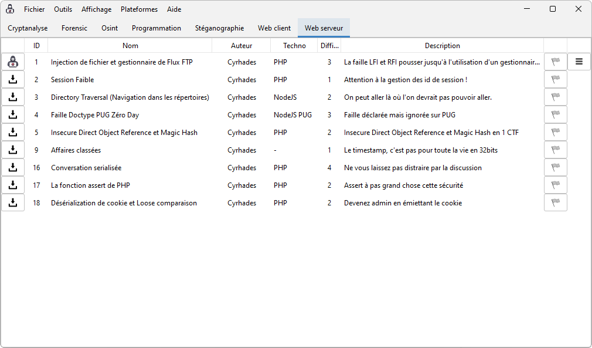

Les CTFs de Cyrhades (version beta)
====================
🎉 🥳 **Nouvelle version en Java.** 🥳 🎉

Des challenges seront ajoutés réguliérement (environ 1 par semaine)

Bon challenges à tous !

----------------------

Concernant cette nouvelle version il n'y a aucun CTF d'intégrer de base, vous téléchargez via l'interface uniquement ceux que vous souhaitez faire.

Installation
------------
> git clone https://github.com/Hack-Oeil/les-ctfs-de-cyrhades

Vous pouvez lancer l'application en double cliquant sur **les-ctfs-de-cyrhades.jar** ou avec la commande : 
> java -jar les-ctfs-de-cyrhades.jar

Dependances
-----------
🐋 Docker est indispensable pour les challenges dockerisés, comme c'est le cas pour les catégories WEB et Programmation.
Cependant il n'est pas obligatoire si vous utilisez l'application pour les challenges  de type cryptanalyse, stéganographie, forensic, OSINT. 

----------------------

🏴 Les CTFs  :
----------------
- **Cryptanalyse**
    - **CRYPTANALYSE_SUR_MD5** : Déchiffrer déchiffrer du MD5
    - **CRYPTANALYSE_CODE_DE_CESAR_1** : Ave, César !
    - **CRYPTANALYSE_BASE64_DIVISE_PAR_2** : Vous connaissez le Base 64, c'est un bon début alors ...
    - **CRYPTANALYSE_ASCIIPARAIT** : L'hexa c'est facile Ascii parait
    - **CRYPTANALYSE_VIGENERE** : Petite lettre à un ami
- **Programmation**
    - **LA_CARTE_MANQUANTE** : La carte manquante
    - **CLAIR_DE_LUNE** : L'algorithme de Luhn, également connu sous le nom de "modulus 10"
    
- **Stéganographie**
    - **STEGANO_EXERCICE_1** : Une image mais pas que
    - **STEGANO_EXERCICE_2** : Sage comme une imageS
    - **STEGANO_EXERCICE_3** : A la recherche des pixels presque invisibles

- **Web client**
    - **XSS_REFLECTED** : Chercher la faille XSS Reflected
    - **XSS_DOM_TRADINGVIEW** : XSS Dom, donnez votre langue au chat
    - **WEB_CLIENT_DISABLED_BUTTON_AND_CONTROL** : Le bouton est désactivé mais même en le réactivant on ne peut pas jouer !
    - **XSS_DOM_TRADINGVIEW_2** : XSS Dom, cette fois c'est pas les cookies !
    - **CRLF_XSS_STORED_SESSION** : Un pirate a voulu nous tendre un piège, retournez la situation.

- **Web serveur**
    - **PHP_LFI_RFI_WRAPPER_FTP** : Injection de fichier et gestionnaire de Flux FTP
    - **PHP_WEAK_SESSION** : Session Faible
    - **NODE_DIRECTORY_TRAVERSAL** : Directory Traversal (Navigation dans les répertoires)
    - **NODE_PUG_DOCTYPE_ZERO_DAY** : Faille Doctype PUG Zéro Day
    - **PHP_IDOR_AND_MAGIC_HASH** :  Insecure Direct Object Reference et Magic Hash
    - **CTF_AFFAIRE_CLASSEE** :  Le timestamp, c'est pas pour toute la vie en 32bits
    - **UNSERIALIZE_CONVERSATION** : Ne vous laissez pas distraire par la discussion
    - **PHP_CTF_ASSERT_LFI** : Assert à pas grand chose cette sécurité
    - **PHP_COOKIE_SERIALIZE_LOOSE_COMPARAISON** : Devenez admin en émiettant le cookie
    - **LOCAL_FILE_INCLUSION_BUILD_CSS** : Un builder CSS maison
    - **LOCAL_FILE_INCLUSION_DOWNLOAD** : Téléchargement de fichier sans contrôle
    - **INJECTION_SQL_UNION_SELECT** : Dans cet exercice il est possible de chercher des vêtements, mais pas que.
    - **INJECTION_SQL_ROUTED** : En fonction de la catégorie choisie, les articles associés sortiront.
